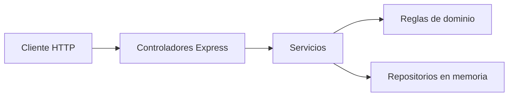

# Reservas de coworking — backend con Extreme Programming y BDD

Backend de un sistema de reservas de salas y escritorios. Está escrito en TypeScript estricto, expone una API REST con Express y usa Cucumber para comprobar, en español de negocio, que el sistema se comporta como dicen las historias de usuario.

Este README es la bitácora del trabajo. Recorre las tres fases del proyecto en el orden en que se hacen en Extreme Programming (XP): primero el comportamiento que el negocio espera, después una prueba que falla, después el código mínimo que la pone en verde y, al final, una refactorización que no cambia lo que ya pasaba.

El backlog formal, con identificadores y estado, está en [BACKLOG.md](BACKLOG.md). Acá se explica cómo se llegó a cada decisión, con el ejemplo concreto de la reserva de la Sala A.

## Cómo ejecutarlo

Hace falta Node.js 20 o superior. En la carpeta del proyecto:

```powershell
npm install
npm run dev
```

Abrí `http://localhost:3000` en el navegador. Esa dirección muestra la portada. Las operaciones de la API están en `http://localhost:3000/api`. Al arrancar siembra tres espacios:

| Espacio | Tipo | Capacidad | Precio por día |
| --- | --- | --- | --- |
| Sala A | sala | 8 | 100 créditos |
| Sala B | sala | 4 | 80 créditos |
| Escritorio 1 | escritorio | 1 | 40 créditos |

Cada cuenta nueva recibe **300 créditos** de bienvenida. Con eso alcanza para la Sala A (quedan 200) y no alcanza para un espacio de 500.

La suite de comportamiento no necesita el servidor levantado. Cucumber llama a la API por dentro del proceso:

```powershell
npm run test:e2e
```

La última ejecución de esta entrega dio:

```text
30 scenarios (30 passed)
195 steps (195 passed)
```

En Node 24, Cucumber puede avisar que esa versión del runtime no está en su matriz de pruebas. La suite igual corre. El workflow de GitHub Actions usa Node 20.

El resto de los comandos:

| Comando | Qué hace |
| --- | --- |
| `npm run dev` | Levanta la API con `ts-node` y el catálogo de ejemplo |
| `npm run test:e2e` | Ejecuta los `.feature` con Cucumber |
| `npm run lint` | ESLint sobre `src/` y `tests/` |
| `npm run typecheck` | `tsc --noEmit` con `strict` |
| `npm run build` | Compila a `dist/` |
| `npm start` | Corre la versión compilada |
| `npm run verificar` | Lint, tipos, compilación y Cucumber, en ese orden |

En PowerShell, `curl` es un alias de `Invoke-WebRequest`. Los ejemplos de este documento usan `curl.exe`.

Variables de entorno opcionales:

| Variable | Valor por defecto | Para qué sirve |
| --- | --- | --- |
| `PORT` | `3000` | Puerto HTTP |
| `TOKEN_SECRET` | `dev-secret-xp` | Secreto HMAC del token. En un despliegue real hay que cambiarlo |
| `BCRYPT_ROUNDS` | `8` | Factor de costo de bcrypt. Entero entre 4 y 15 |

## Mapa del repositorio

```text
features/                         historias en Gherkin, una por historia funcional
tests/step_definitions/           cada frase Gherkin unida a TypeScript
tests/support/                    el mundo de la prueba y el reinicio entre escenarios
src/dominio/                      entidades y reglas puras
src/aplicacion/                   casos de uso y puertos (interfaces)
src/infraestructura/http/         Express: rutas, auth y errores
src/infraestructura/persistencia/ repositorio en memoria
src/infraestructura/seguridad/    bcrypt y token HMAC
src/composicion/crearAplicacion.ts  arma las piezas
.github/workflows/main.yml        integración continua
BACKLOG.md                        historias y criterios de aceptación
```

## Paso 1. Elegir un dominio chico

El enunciado deja elegir el sistema. Se eligió **reservas de coworking** porque el ejemplo del propio enunciado ya habla en ese idioma (`Sala A`, saldo, estado `Ocupada`) y porque cabe en seis historias sin inventar un carrito, pagos ni roles.

Reglas de negocio que quedaron fijas antes de programar:

- Una reserva ocupa el espacio **entero** durante un día (`2026-10-15`). La capacidad se guarda y se muestra, y no parte la sala en puestos. Partirla sería otra historia.
- El estado `Disponible` / `Ocupada` se **calcula** para una fecha. No se guarda en la sala, porque la misma Sala A puede estar ocupada el 15 y libre el 16.
- El dinero de esta entrega son créditos. Al registrarse, la persona recibe 300. Reservar descuenta el precio del día. Cancelar lo devuelve.
- La contraseña nunca vuelve en un JSON.

## Paso 2. Fase 1 — historias de usuario

En XP el requerimiento se escribe desde quien usa el sistema y desde el valor que obtiene. El formato pedido es:

```text
Como <rol>, quiero <acción> para <beneficio>.
```

Cada historia lleva criterios de aceptación: condiciones observables que dicen cuándo está terminada. Esos criterios, más adelante, se convierten casi literales en escenarios de Cucumber.

### Ejemplo trabajado: cómo se redactó la reserva

Primero se escribió en bruto: "los usuarios reservan salas". Eso no se puede probar. Se reescribió con rol, acción y beneficio:

```text
Como usuario autenticado,
quiero reservar un espacio disponible,
para tener un lugar de trabajo.
```

Después se preguntó "¿cuándo doy esta historia por hecha?" y salieron cuatro criterios, no una lista infinita:

1. Camino feliz: hay lugar y hay saldo. La reserva queda confirmada, se cobran los créditos y la sala figura ocupada ese día.
2. Límite: la sala ya tiene una reserva confirmada. Se rechaza y no se le cobra a quien llegó segundo.
3. Límite: el saldo no alcanza. Se rechaza y el saldo queda igual.
4. Límite: la fecha ya pasó, o ni siquiera es una fecha (`2026-02-31`).

Esos cuatro criterios son la HU-04. El mismo procedimiento produjo las otras siete historias. El texto completo está en [BACKLOG.md](BACKLOG.md). Resumen:

| ID | Historia | Criterio que más importa |
| --- | --- | --- |
| HU-01 | Registrarse | La cuenta se crea, la contraseña no sale en la respuesta y el email duplicado se rechaza |
| HU-02 | Iniciar sesión | Hay token si la clave es correcta. Si no, el mensaje es siempre `credenciales inválidas` |
| HU-03 | Ver disponibilidad | `Disponible` u `Ocupada` según la fecha, y solo con sesión |
| HU-04 | Reservar | Confirma, cobra y ocupa. Rechaza ocupado, saldo corto y fecha inválida |
| HU-05 | Cancelar | Devuelve el crédito y libera la sala. Otra persona no puede cancelar |
| HU-06 | Ver mis reservas | Cada quien ve solo las suyas. Sin reservas, la lista va vacía |
| HU-NF-01 | Seguridad | bcrypt con sal. La misma clave no produce el mismo hash |
| HU-NF-02 | Rendimiento | Salud y disponibilidad responden en menos de 200 ms |

Las dos últimas son historias técnicas. El rol no es el cliente del coworking: es un auditor y un administrador del sistema. Igual tienen criterios que se pueden ejecutar.

## Paso 3. Fase 2 — del criterio al archivo `.feature`

Cucumber lee archivos Gherkin. Cada historia funcional tiene el suyo en `features/`. La frase `Feature` repite el "como / quiero / para". Debajo van escenarios.

Se usaron las palabras clave en inglés (`Feature`, `Scenario`, `Given`, `When`, `Then`, `And`, `Background`) y el resto de la frase en español, como en el ejemplo del enunciado. Cucumber no traduce solo: la frase entera tiene que coincidir con un paso en TypeScript.

`Given` prepara el mundo. `When` es la acción que se está especificando. `Then` comprueba el resultado. `And` repite la palabra clave anterior. `Background` corre antes de cada escenario del archivo, para no copiar el registro y el login en todos.

### El camino feliz de la HU-04, línea por línea

Este es el escenario que cumple el primer criterio de la reserva. Está en `features/reserva-de-espacio.feature`.

```gherkin
Feature: Reserva de espacios
  Como usuario autenticado
  Quiero reservar un espacio disponible
  Para tener un lugar de trabajo

  Background:
    Given que el usuario "Juan" ya está registrado con email "juan@correo.com" y contraseña "secreto123"
    And que "Juan" tiene una sesión activa

  Scenario: Reserva exitosa de un espacio disponible
    Given que existe el espacio "Sala A" de tipo "sala" con capacidad 6 y precio 100
    When "Juan" reserva el espacio "Sala A" para el "2026-10-15"
    Then la respuesta tiene código 201
    And la reserva queda en estado "confirmada"
    And el saldo de "Juan" es 200
    When "Juan" consulta la disponibilidad para el "2026-10-15"
    Then el espacio "Sala A" figura como "Ocupada"
```

Lectura de cada línea:

1. El `Background` crea a Juan por `POST /api/usuarios` y toma un token con `POST /api/sesion`. Juan arranca con 300 créditos. Esto es preparación, no el comportamiento bajo prueba.
2. `Given que existe el espacio "Sala A"...` carga la sala en el servicio de espacios. Crear salas por HTTP sería la HU-08, que está pendiente, así que el Given no pasa por un endpoint público.
3. `When "Juan" reserva...` sí pega a la API: `POST /api/reservas` con el token de Juan. Este es el comportamiento.
4. `Then` mira el código `201`, el estado `confirmada` y el saldo. 300 − 100 = 200.
5. El segundo `When` consulta `GET /api/espacios?fecha=2026-10-15` y exige que Sala A figure `Ocupada`. El estado no se pidió en el alta de la reserva: se observa en la disponibilidad, que es lo que vería otra persona.

Al lado de ese camino feliz, el mismo archivo tiene los límites: sala ocupada (`409` y el saldo de Ana sigue en 300), saldo insuficiente (Sala Premium a 500 créditos), fecha `2020-01-01` y fecha `2026-02-31`.

### Los otros archivos, con su camino feliz y su error

Cada archivo tiene al menos un escenario feliz y uno de fallo. Estos son los que anclan la historia; el archivo completo tiene los demás límites.

**Registro** (`features/registro-de-usuario.feature`)

```gherkin
Scenario: Registro exitoso de un visitante nuevo
  When un visitante se registra con nombre "Juan", email "juan@correo.com" y contraseña "secreto123"
  Then la respuesta tiene código 201
  And la respuesta incluye el email "juan@correo.com"
  And la contraseña no aparece en la respuesta
  And el usuario creado tiene saldo 300

Scenario: Registro rechazado por email duplicado
  Given que el usuario "Juan" ya está registrado con email "juan@correo.com" y contraseña "secreto123"
  When un visitante se registra con nombre "Otro", email "juan@correo.com" y contraseña "otraclave1"
  Then la respuesta tiene código 409
  And el mensaje de error contiene "email ya registrado"
```

También se rechaza `Juan@Correo.com` si ya existe `juan@correo.com`, una contraseña `corta`, un email sin `@` y un nombre vacío.

**Inicio de sesión** (`features/inicio-de-sesion.feature`)

```gherkin
Scenario: Inicio de sesión exitoso
  Given que el usuario "Juan" ya está registrado con email "juan@correo.com" y contraseña "secreto123"
  When "Juan" inicia sesión con email "juan@correo.com" y contraseña "secreto123"
  Then la respuesta tiene código 200
  And la respuesta incluye un token de acceso
  When "Juan" consulta sus reservas
  Then la respuesta tiene código 200

Scenario: Contraseña incorrecta
  Given que el usuario "Juan" ya está registrado con email "juan@correo.com" y contraseña "secreto123"
  When "Juan" inicia sesión con email "juan@correo.com" y contraseña "incorrecta1"
  Then la respuesta tiene código 401
  And el mensaje de error contiene "credenciales inválidas"
```

Un email que no existe devuelve el mismo `401` y el mismo mensaje. Así la API no cuenta si la cuenta está registrada.

**Disponibilidad** (`features/consulta-de-disponibilidad.feature`)

```gherkin
Scenario: Un espacio reservado figura ocupado solo en esa fecha
  Given que "Juan" ya reservó el espacio "Sala A" para el "2026-10-15"
  When "Juan" consulta la disponibilidad para el "2026-10-15"
  Then el espacio "Sala A" figura como "Ocupada"
  And el espacio "Sala B" figura como "Disponible"
  When "Juan" consulta la disponibilidad para el "2026-10-16"
  Then el espacio "Sala A" figura como "Disponible"
```

Sin token, la consulta responde `no autenticado`. Con el token `token-falso`, responde `token inválido`.

**Cancelación** (`features/cancelacion-de-reserva.feature`)

```gherkin
Scenario: Cancelar una reserva propia libera la sala y reintegra el saldo
  Given que "Juan" ya reservó el espacio "Sala A" para el "2026-10-15"
  When "Juan" cancela su reserva del espacio "Sala A" del "2026-10-15"
  Then la respuesta tiene código 200
  And la reserva queda en estado "cancelada"
  And el saldo de "Juan" es 300
  When "Juan" consulta la disponibilidad para el "2026-10-15"
  Then el espacio "Sala A" figura como "Disponible"
```

Ana, con su propio token, recibe `403` si intenta cancelar la de Juan, y el saldo de Juan sigue en 200. Cancelar dos veces responde `409`.

**Mis reservas** (`features/consulta-de-mis-reservas.feature`)

```gherkin
Scenario: El usuario ve solamente sus reservas
  Given que "Juan" ya reservó el espacio "Sala A" para el "2026-10-15"
  And que "Ana" ya reservó el espacio "Sala B" para el "2026-10-15"
  When "Juan" consulta sus reservas
  Then la lista contiene 1 reservas
  And la lista incluye el espacio "Sala A"
  And la lista no incluye el espacio "Sala B"
```

La frase dice `1 reservas` a propósito: un solo paso de TypeScript cubre 0 y 1. Sin reservas, la lista viene vacía y el código es `200`. Sin token, `401`.

**Requisitos no funcionales** (`features/requisitos-no-funcionales.feature`)

```gherkin
Scenario: Dos cuentas con la misma contraseña no comparten el hash
  When un visitante se registra con nombre "Ana", email "ana@correo.com" y contraseña "secreto123"
  And un visitante se registra con nombre "Luis", email "luis@correo.com" y contraseña "secreto123"
  Then los hashes de "ana@correo.com" y "luis@correo.com" son distintos

Scenario: La consulta de disponibilidad responde en menos de 200 ms
  When "Juan" consulta la disponibilidad para el "2026-10-15"
  Then la respuesta tiene código 200
  And el tiempo de respuesta es menor a 200 milisegundos
```

El hash se lee del repositorio, no del JSON. La API pública no devuelve contraseñas. El tiempo se mide solo en el `When`, con `Date.now()` alrededor de la petición.

## Paso 4. Dejar Cucumber listo para TypeScript

`cucumber.js` le dice a Cucumber que compile los pasos con `ts-node` y dónde están:

```javascript
module.exports = {
  default: {
    requireModule: ['ts-node/register'],
    require: ['tests/support/**/*.ts', 'tests/step_definitions/**/*.ts'],
    paths: ['features/**/*.feature'],
    format: ['summary'],
  },
};
```

`tsconfig.json` tiene `"strict": true`. La compilación que publica `dist/` usa `tsconfig.build.json` y solo incluye `src/`, porque las pruebas corren con `ts-node` y no hace falta emitirlas.

El script del enunciado es `npm run test:e2e`.

## Paso 5. Fase RED — el paso existe y el producto todavía no

En XP el ciclo es: escribir la prueba, verla fallar, escribir el mínimo código, verla pasar, refactorizar. Esta entrega queda en verde (30 escenarios). El rojo se recorre así, y conviene poder contarlo.

Si el `.feature` está escrito y el paso todavía no, Cucumber corta con un snippet para copiar. Para la reserva se vería algo de esta forma:

```text
Undefined. Implement with the following snippet:

When('{string} reserva el espacio {string} para el {string}', function (string, string2, string3) {
  return 'pending';
});
```

El primer paso real no lleva lógica de negocio. Solo hace la petición y guarda la respuesta. En ese momento la ruta no existe, así que el `Then la respuesta tiene código 201` falla con `404`. Ese fallo es la fase roja: la prueba describe el negocio y el producto todavía no lo cumple.

El paso, ya en verde, está en `tests/step_definitions/reservas.steps.ts`:

```typescript
When(
  '{string} reserva el espacio {string} para el {string}',
  async function (this: MundoApi, nombre: string, espacio: string, fecha: string) {
    const token = this.tokenDe(nombre);
    await this.medir(() =>
      request(this.app)
        .post('/api/reservas')
        .set('Authorization', `Bearer ${token}`)
        .send({ espacio, fecha }),
    );
    if (this.respuesta?.status === 201) {
      const cuerpo = this.respuesta.body as { id: string };
      this.recordarReserva(nombre, espacio, fecha, cuerpo.id);
    }
  },
);
```

`{string}` es una expresión de Cucumber: captura el texto entre comillas. `this` es el mundo de la prueba (`tests/support/mundo.ts`): ahí viven la app de Express, los tokens y los ids de reserva. Antes de cada escenario, `tests/support/hooks.ts` llama a `reiniciar()`, que construye una aplicación nueva con los repositorios vacíos. Un escenario no puede dejarle una reserva al siguiente.

Los `Then` genéricos (`la respuesta tiene código`, `el mensaje de error contiene`, `el tiempo de respuesta es menor a`) están una sola vez en `tests/step_definitions/comunes.steps.ts`. Cucumber une el paso por el texto, no por la palabra `Then` o `And`, así que la misma definición sirve en las siete features.

## Paso 6. Fase GREEN — el mínimo para que la reserva pase

La arquitectura tiene tres capas. El controlador no decide si hay saldo. El servicio no conoce Express. El repositorio no conoce la regla de ocupación.



`src/composicion/crearAplicacion.ts` es el único lugar que elige implementaciones concretas: memoria, bcrypt y HMAC. Los servicios reciben interfaces (`src/aplicacion/puertos.ts`).

El `When` de arriba termina en el controlador, que solo traduce JSON y status:

```typescript
router.post(
  '/reservas',
  proteger,
  adaptar(async (req, res) => {
    const cuerpo = req.body as { espacio?: unknown; fecha?: unknown };
    const reserva = reservas.reservar({
      usuarioId: usuarioAutenticado(req),
      espacio: exigirTexto(cuerpo.espacio, 'espacio'),
      fecha: exigirTexto(cuerpo.fecha, 'fecha'),
    });
    res.status(201).json(reserva);
  }),
);
```

`adaptar` existe porque Express 4 no captura promesas rechazadas. Sin eso, un `throw` dentro de un `async` no llegaría al manejador de errores.

La regla vive en `ServicioReservas.reservar`:

```typescript
afirmarFechaReservable(entrada.fecha, this.hoy());

const espacio = this.espacios.buscarPorNombre(entrada.espacio);
if (!espacio) {
  throw new ErrorDeAplicacion('espacio no encontrado', 404);
}

const usuario = this.usuarios.buscarPorId(entrada.usuarioId);
if (!usuario) {
  throw new ErrorDeAplicacion('usuario no encontrado', 404);
}

if (hayReservaConfirmada(this.reservas.listar(), espacio.id, entrada.fecha)) {
  throw new ErrorDeAplicacion('el espacio está ocupado en esa fecha', 409);
}

if (usuario.saldo < espacio.precioPorDia) {
  throw new ErrorDeAplicacion('saldo insuficiente', 400);
}

const saldoRestante = usuario.saldo - espacio.precioPorDia;
this.usuarios.actualizar({ ...usuario, saldo: saldoRestante });

const reserva: Reserva = {
  id: randomUUID(),
  usuarioId: usuario.id,
  espacioId: espacio.id,
  espacio: espacio.nombre,
  fecha: entrada.fecha,
  estado: 'confirmada',
  costo: espacio.precioPorDia,
};
this.reservas.guardar(reserva);
return { ...reserva, saldoRestante };
```

El orden importa y está fijado por los escenarios de error:

1. Primero la fecha. `2020-01-01` ni siquiera mira el saldo. "Hoy" se calcula en `America/Argentina/Buenos_Aires`, así que no depende de que el servidor esté en UTC.
2. Después se busca la sala y a la persona.
3. Si ya hay una reserva `confirmada` para esa sala y esa fecha, `409`. El saldo de Ana sigue en 300 porque la resta todavía no ocurrió.
4. Si el precio es mayor que el saldo, `400` y tampoco se resta.
5. Recién ahí se descuenta y se guarda la reserva.

`ErrorDeAplicacion` lleva el mensaje y el código HTTP. Un solo middleware los convierte en `{ "error": "..." }`. Un error inesperado cae en `500` con `error interno`, sin filtrar el stack al cliente.

Con eso, el escenario feliz y los cuatro de límite pasan. Ahí termina el verde de la HU-04. Recién después se mejora el código.

## Paso 7. Refactorizar sin cambiar el comportamiento

XP pide mejorar el diseño cuando la prueba ya está verde. Estas son las tres refactorizaciones que quedaron en el código, cada una forzada por un escenario que ya existía.

### El estado de la sala se calcula

Guardar `estado: "Ocupada"` dentro de la sala haría pasar el `Then` del 15 de octubre y rompería el del 16: la sala seguiría ocupada al día siguiente. La regla quedó en una función pura, `hayReservaConfirmada`, en `src/dominio/reglas.ts`:

```typescript
export function hayReservaConfirmada(reservas: Reserva[], espacioId: string, fecha: string): boolean {
  return reservas.some(
    (reserva) =>
      reserva.espacioId === espacioId && reserva.fecha === fecha && reserva.estado === 'confirmada',
  );
}
```

La usa tanto reservar como listar la disponibilidad. Al cancelar, la reserva pasa a `cancelada` y la misma función deja de contarla: la sala vuelve a `Disponible` sin un segundo campo que actualizar. El escenario de cancelación es el que protege este diseño.

### La contraseña no se arma a mano en el controlador

El escenario `la contraseña no aparece en la respuesta` falla si cualquier endpoint copia el usuario completo al JSON. La función `publicarUsuario` devuelve solo `id`, `nombre`, `email` y `saldo`. Registro, login y `GET /api/usuarios/yo` pasan por ahí. El hash se queda en el repositorio, que es donde el escenario de bcrypt lo lee.

### La misma clave no puede producir el mismo hash

`CifradorBcrypt` usa `bcryptjs`. El hash incluye la sal, así que Ana y Luis, con `secreto123` los dos, quedan con valores distintos. El servicio de usuarios depende de la interfaz `Cifrador`, no de la librería. Cambiar el algoritmo sería otro adaptador.

En el login, si el email no existe, igual se compara contra un hash de relleno. La respuesta sigue siendo `credenciales inválidas`. El costo de bcrypt se paga en los dos casos, y el mensaje no dice cuál de los dos datos falló.

## Paso 8. El mismo ciclo en el resto de las historias

Cada historia repitió el circuito: feature, paso, fallo, servicio, verde. El código de producción que las sostiene:

| Historia | Regla de negocio | Dónde quedó |
| --- | --- | --- |
| HU-01 | Email único en minúsculas, contraseña de al menos 8, saldo inicial 300 | `validarRegistro` y `ServicioUsuarios.registrar` |
| HU-02 | Token solo si el hash coincide | `ServicioAuth.iniciarSesion` y `EmisorHmac` |
| HU-03 | Lista de espacios con estado por fecha | `ServicioEspacios.disponibilidad` |
| HU-04 | Fecha, ocupación, saldo, recién ahí cobrar | `ServicioReservas.reservar` |
| HU-05 | Solo el dueño, una sola vez, y se devuelve el costo | `ServicioReservas.cancelar` |
| HU-06 | Filtrar por `usuarioId` | `ServicioReservas.listarPropias` |
| HU-NF-01 | bcrypt con sal | `CifradorBcrypt` |
| HU-NF-02 | Consultas sin trabajo de hash | `GET /api/salud` y `GET /api/espacios` |

El token no usa una librería JWT. Es `base64url(payload).hmac-sha256`, con el id del usuario y un vencimiento de 12 horas. Alcanza para los escenarios de "token de acceso" y "token alterado", y no suma una dependencia. La firma se compara con `timingSafeEqual`.

La cancelación es `POST /api/reservas/:id/cancelacion` y la reserva sigue existiendo con estado `cancelada`. Borrarla con `DELETE` le quitaría a la persona el registro de lo que canceló, y la HU-06 pide ver sus reservas.

Express responde así:

| Situación | Código | Mensaje |
| --- | --- | --- |
| Cuenta creada | 201 | el usuario público, con saldo 300 |
| Reserva creada | 201 | reserva `confirmada` y `saldoRestante` |
| Login correcto, listados, cancelación, perfil | 200 | el recurso |
| Dato inválido, saldo corto, fecha mala | 400 | el motivo |
| Sin token o token malo | 401 | `no autenticado` o `token inválido` o `credenciales inválidas` |
| Cancelar la reserva de otra persona | 403 | `otro usuario` |
| Email repetido, sala ocupada, cancelar dos veces | 409 | el motivo |
| Ruta inexistente | 404 | `ruta no encontrada` |

## Paso 9. Recorrer la API a mano

Con `npm run dev` en una terminal, en otra:

```powershell
curl.exe -s http://localhost:3000/api/salud
```

```json
{ "estado": "ok" }
```

Registro:

```powershell
curl.exe -s -X POST http://localhost:3000/api/usuarios -H "Content-Type: application/json" -d "{\"nombre\":\"Juan\",\"email\":\"juan@correo.com\",\"contrasena\":\"secreto123\"}"
```

```json
{
  "id": "…",
  "nombre": "Juan",
  "email": "juan@correo.com",
  "saldo": 300
}
```

El campo JSON es `contrasena`, sin eñe, para poder copiarlo en cualquier terminal. Repetir el mismo email responde `409`:

```json
{ "error": "email ya registrado" }
```

Login:

```powershell
curl.exe -s -X POST http://localhost:3000/api/sesion -H "Content-Type: application/json" -d "{\"email\":\"juan@correo.com\",\"contrasena\":\"secreto123\"}"
```

La respuesta trae `token` y el usuario. Ese token se usa como `Authorization: Bearer …`. En PowerShell conviene guardarlo:

```powershell
$sesion = curl.exe -s -X POST http://localhost:3000/api/sesion -H "Content-Type: application/json" -d "{\"email\":\"juan@correo.com\",\"contrasena\":\"secreto123\"}" | ConvertFrom-Json
$token = $sesion.token
```

Disponibilidad, con las tres salas sembradas, todas `Disponible`:

```powershell
curl.exe -s "http://localhost:3000/api/espacios?fecha=2026-10-15" -H "Authorization: Bearer $token"
```

Reservar la Sala A:

```powershell
curl.exe -s -X POST http://localhost:3000/api/reservas -H "Authorization: Bearer $token" -H "Content-Type: application/json" -d "{\"espacio\":\"Sala A\",\"fecha\":\"2026-10-15\"}"
```

```json
{
  "espacio": "Sala A",
  "fecha": "2026-10-15",
  "estado": "confirmada",
  "costo": 100,
  "saldoRestante": 200
}
```

A partir de ahí, `GET /api/espacios?fecha=2026-10-15` muestra Sala A como `Ocupada`. `GET /api/reservas` devuelve solo las de Juan. `GET /api/usuarios/yo` muestra el saldo en 200.

Cancelar, usando el `id` que devolvió la reserva:

```powershell
curl.exe -s -X POST http://localhost:3000/api/reservas/ID-DE-LA-RESERVA/cancelacion -H "Authorization: Bearer $token"
```

El estado pasa a `cancelada`, `saldoRestante` vuelve a 300 y Sala A figura otra vez `Disponible`. Este recorrido se ejecutó contra el servidor de desarrollo en esta entrega: registro, duplicado en `409`, login, listado, reserva, ocupación, perfil en 200 créditos, cancelación y consulta anónima en `401`.

Consultar espacios sin el encabezado también responde `401`.

## Paso 10. Integración continua

`.github/workflows/main.yml` corre en cada `push` y en cada pull request, con Node 20:

1. `npm ci`
2. `npm run lint`
3. `npm run typecheck`
4. `npm run build`
5. `npm run test:e2e`

Si un escenario se rompe, el workflow falla. Esa es la práctica de integración continua de esta entrega: la suite de comportamiento es la puerta, no un paso manual. Hace falta el `package-lock.json` porque `npm ci` instala exactamente esas versiones.

## Decisiones de diseño, atadas a XP

**Diseño simple.** Express, sin Nest ni un contenedor de inyección. Hay una función, `crearAplicacion`, que conecta las piezas. YAGNI (*You Aren't Gonna Need It*): no se construye la pieza hasta que una historia la pide.

**La persistencia es un puerto.** Los servicios hablan con `RepositorioUsuarios`, `RepositorioEspacios` y `RepositorioReservas`. Hoy la implementación es un `Map` en memoria, porque HU-07 (sobrevivir a un reinicio) está pendiente. Cuando esa historia entre, se escribe otro adaptador. Los escenarios de Cucumber no tendrían que cambiar de redacción: cambian el mundo de prueba, no las frases de negocio.

**La capacidad no reserva puestos sueltos.** Se guarda porque el listado la muestra. No hay una regla de "quedan 3 de 8 sillas" porque ninguna historia la pide.

**El catálogo de `npm run dev` está sembrado en el arranque.** Sala A, Sala B y Escritorio 1. No hay `POST /api/espacios`. Esa sería la HU-08.

**Un escenario, un mundo.** Cada escenario construye su propia aplicación. La suite puede correr en cualquier orden.

**Las pruebas miran comportamiento.** Los `When` y los `Then` de la API usan Supertest contra Express, sin abrir un puerto. Los `Given` de "ya está registrado" también pasan por HTTP, así que usan el mismo registro que el cliente. La excepción es crear el espacio y leer el hash: lo primero porque no hay endpoint, lo segundo porque la API no debe mostrar la contraseña.

**TypeScript estricto.** `strict`, `noUnusedLocals`, `noUnusedParameters` y `noImplicitReturns`. El linter cubre `src/` y `tests/`.

**Lo que esta entrega deja escrito y sin implementar** está en el backlog como HU-07 y HU-08, para que el límite sea explícito y no un olvido.

## Cómo se demuestra cada práctica

| Práctica XP | Dónde se ve |
| --- | --- |
| Historias de usuario y criterios de aceptación | [BACKLOG.md](BACKLOG.md) |
| BDD con Gherkin | `features/*.feature` |
| Paso de Cucumber en TypeScript | `tests/step_definitions/` |
| Ciclo red-green-refactor | Pasos 5, 6 y 7 de este documento, y la suite en verde |
| Diseño simple y YAGNI | Express, memoria, sin catálogo público ni PostgreSQL |
| Refactor con pruebas como red | `publicarUsuario`, `hayReservaConfirmada` |
| Capas separadas | `src/infraestructura/http`, `src/aplicacion`, `src/dominio` |
| Integración continua | `.github/workflows/main.yml` |

## Referencia rápida de la API

Todas las rutas cuelgan de `/api`. Las que dicen "token" necesitan `Authorization: Bearer <token>`.

| Método y ruta | Auth | Cuerpo | Respuesta |
| --- | --- | --- | --- |
| `GET /salud` | no | — | `{ "estado": "ok" }` |
| `POST /usuarios` | no | `nombre`, `email`, `contrasena` | usuario público, sin hash |
| `POST /sesion` | no | `email`, `contrasena` | `{ token, usuario }` |
| `GET /usuarios/yo` | token | — | usuario público, con saldo |
| `GET /espacios?fecha=YYYY-MM-DD` | token | — | espacios con `estado` |
| `POST /reservas` | token | `espacio`, `fecha` | reserva y `saldoRestante` |
| `POST /reservas/:id/cancelacion` | token | — | reserva `cancelada` y saldo reintegrado |
| `GET /reservas` | token | — | solo las reservas de esa persona |

Los datos del proceso viven en memoria. Al frenar `npm run dev` se borran. Eso es coherente con la HU-07 todavía pendiente.
